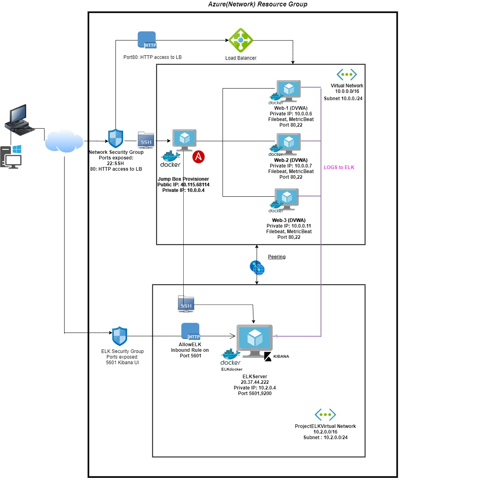
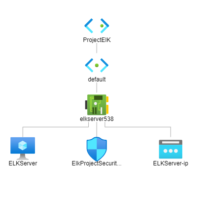

# ELKStack-Project
First Project Cyber Security

## Automated ELK Stack Deployment
The files in this repository were used to configure the network depicted below.




These files have been tested and used to generate a live ELK deployment on Azure. They can be used to either recreate the entire deployment pictured above. Alternatively, select portions of the ansible playbook and config file may be used to install only certain pieces of it, such as Filebeat.

- Ansible Playbook
- Ansible Hosts
- Ansible Configuration
- Ansible ELK Installation and VM Configuration
- Ansible Filebeat Playbook
- Ansible Filebeat Config file
- Ansible Metricbeat Playbook
- Ansible Metricbeat Config file

## This document contains the following details:
- Description of the Topology
- Access Policies
- ELK Configuration
  - Beats in Use
  - Machines Being Monitored
- How to Use the Ansible Build


### Description of the Topology




The main purpose of this network is to expose a load-balanced and monitored instance of DVWA, the `D*mn Vulnerable Web Application`.

Load balancing ensures that the application will be highly available, in addition to restricting access to the network.
- What aspect of security do load balancers protect?
   - Load Balancing plays a crucial role in the security as the systems are becoming more and more cloaud oriented.The load balancer distributes the traffic intelligently thus defends the systems against distributed denial-of-service (DDoS) attacks. It distributes the workloads across multiple servers,y known as a server cluster. It adds an additional layer of security to system without impacting the application in any way.Load balancer improves service availability and reduces downtime.
 - What is the advantage of a jump box?
   - The advantage of a jump box is that it is a single, secure point of entry to organizations other network resources. It prevents the public exposure of VM's.It is a SSH gateway to a remote network, and can be configured to connect to other host in some other security zone, for example in a demilitarized zone (DMZ). It  offers controlled access between different security zones.

Integrating an ELK server allows users to easily monitor the vulnerable VMs for changes to the files and system statistics.
- What does Filebeat watch for? 
  -  Filebeat is a lightweight shipper, installed as an agent on the server for forwarding and centralizing log data.Log files or locations specified by the user are watched and monitored and then Filebeat collects log events. Once collected the log events are forwarded either to Elasticsearch or Logstash for indexing. 
- What does Metricbeat record?
    - Metricbeat is a lightweight shipper. It records and periodically collects metrics from the operating system and from services running on the server. Once the metrics and statistics are collected, Metricbeat ships them to the output specified by the user such as Elasticsearch or Logstash.

The configuration details of each machine may be found below.


| Name        | Function                      | IP Address                    | Operating System |
| ----------- | ----------------------------  | ----------------------------- | ---------------- |
| Jump Box    | Gateway                       | 10.0.0.4 , 40.115.68.114      | Linux            |
| Web-1       | Webserver (DVWA)              | 10.0.0.6 , 13.70.128.120      | Linux            |
| Web-2       | Webserver (DVWA)              | 10.0.0.7 ,  13.70.128.120     | Linux            |
| Web-3       | Webserver (DVWA)              | 10.0.0.11,                    | Linux            |
| ELK-VM      | Elastic Server( Monitoring)   | 10.2.0.4 ,  20.37.242.179     | Linux            |
| Network_LB  | Load Balancer                 | 13.70.128.120                 | Linux            |

### Access Policies

The machines on the internal network are not exposed to the public Internet. 

Only the Jump Box machine can accept connections from the Internet. Access to this machine is only allowed from the following IP addresses:
- `[218.215.105.127] `

Machines within the network can only be accessed by Jump Box virtual machine.
- The Jump Box VM has access to the ELK VM. The IP address of the Jump Box VM is 10.0.0.4
- The Jump Box VM has access to all the three Webservers in the Virtual Network. The IP address of the three webservers are given in the above table.


A summary of the access policies in place can be found in the table below.

| Name     	      | Publicly Accessible | Allowed IP Addresses      |
| ------------------- | ------------------- | ------------------------  |
| Jump Box 	      | Yes, SSH -22        |  218.215.105.127          |
| Web-1    	      | No                  |  10.0.0.4, 13.70.128.120  |
| Web-2       	      | No                  |  10.0.0.4, 13.70.128.120  |
| Web-3    	      | No                  |  10.0.0.4, 13.70.128.120  |
| ELK-VM   	      |Yes, TCP/5601 & 9200 |  218.215.105.127          |
| Load Balancer       |Yes HTTP Port 80     |  218.215.105.127          |

### Elk Configuration

Ansible was used to automate configuration of the ELK machine. No configuration was performed manually, which is advantageous because it doesnot leave any room for vulnerabilities.
What is the main advantage of automating configuration with Ansible?
- It is free as it is open source.
- Simplicity, no coding skills needed.
- User can model highly complex IT workflows.
- Entire application environment can be orchestrated irrespective of its deployment and can also customize  based on the user needs.
- No need to install any other software or firewall ports on the client systems.
- More space for application resources on the server.
- As it is completely automated thus it helps to deliver more value to the business by spending time on more important tasks.

The playbook implements the following tasks:
- Install Docker
- Install python3-pipInstall docker.io
- Increase virtual memory
- Install Docker python module
- Set the vm.max_map_count to 262144
- Download and launch a docker elk container

The following screenshot displays the result of running `docker ps` after successfully configuring the ELK instance.


### Target Machines & Beats
This ELK server is configured to monitor the following machines:
| Name     | IP Address 
| -------- | ------------------  | 
| Web-1    | 10.0.0.6            |  
| Web-2    | 10.0.0.7            |   
| Web-3    | 10.0.0.11           |

We have installed the following Beats on these machines:
- Filebeat
- Metricbeat

These Beats allow us to collect the following information from each machine:
- Filebeat allows us to collect system log events from the host machines
- Metricbeat allows us to collect metrics and system statistics from host machines.

### Using the Playbook
In order to use the playbook, you will need to have an Ansible control node already configured. Assuming you have such a control node provisioned: 

SSH into the control node and follow the steps below:
- Copy the `filebeat.cfg file to /etc/ansible/filebeat-config.yml `
- Update the file filebeat-config.yml to include 
	```
	output.elasticsearch:
	hosts: ["10.2.0.4:9200"]
	username: "elastic"
	password: "changeme"
	
	setup.kibana:
	host: "10.2.0.4:5601"

 - Save this file in  `/etc/ansible/files/filebeat-config.yml`.

- Run the playbook, and navigate to  to check that the installation worked as expected.
- 
 

 Answer the following questions to fill in the blanks:
- Which file is the playbook? Where do you copy it?
    -  `elk_install.yml` file is the playbook file copy this to ` /etc/ansible/roles/elk_install.yml`
  

- Which file do you update to make Ansible run the playbook on a specific machine? How do I specify which machine to install the ELK server on versus which to install Filebeat on?
   - I updated the Ansible containter host file `etc/ansible/host`. 
   - I added a group called [elk] and specify the Private IP of ELK-VM [10.2.0.4] in /etc/ansible/hosts file.
 	
	```
	[webservers]
	
 	- 10.0.0.6 ansible_python_interpreter=/usr/bin/python3
 	- 10.0.0.7 ansible_python_interpreter=/usr/bin/python3
 	- 10.0.0.11 ansible_python_interpreter=/usr/bin/python3 
	      	
	 [elk]
	 
	- 10.2.0.4 ansible_python_interpreter=/usr/bin/python3 

 -  Then I updated filebeat-playbook.yml & metricbeat-playbook.yml header part
	 ```
	  name: installing and launching metricbeat
  	  hosts: webservers
  	  become: yes
  	  tasks:

- Which URL do you navigate to in order to check that the ELK server is running?
  - The public IP of ELK stack with allowed port number `[20.37.242.179:5601]`.

_As a **Bonus**, provide the specific commands the user will need to run to download the playbook, update the files, etc._

